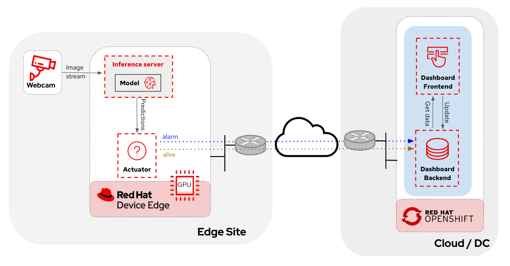
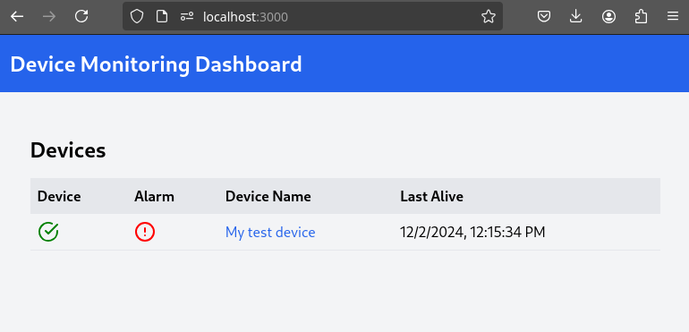

# Object detection with Webcam

This is an example use case of how you can use a webcam to detect objects at the edge, and how those detections can trigger messages/alarms that can be visualized in a dashboard on the Core Datacenter/Cloud.

## Application architecture

## Application workflow

1. The inference server, that contains the AI model detecting objects, publish the predictions in an endpoint
2. The "action" service calls the inference endpoint and if detects certain objects it will trigger an alarm, that is sent to the database hosted in a remote site.
3. The information of the database is shown in the database

## Example screenshots

Live video stream detection from the inference server:

Main Dashboard screen:

Device details screen on the Dashboard:

