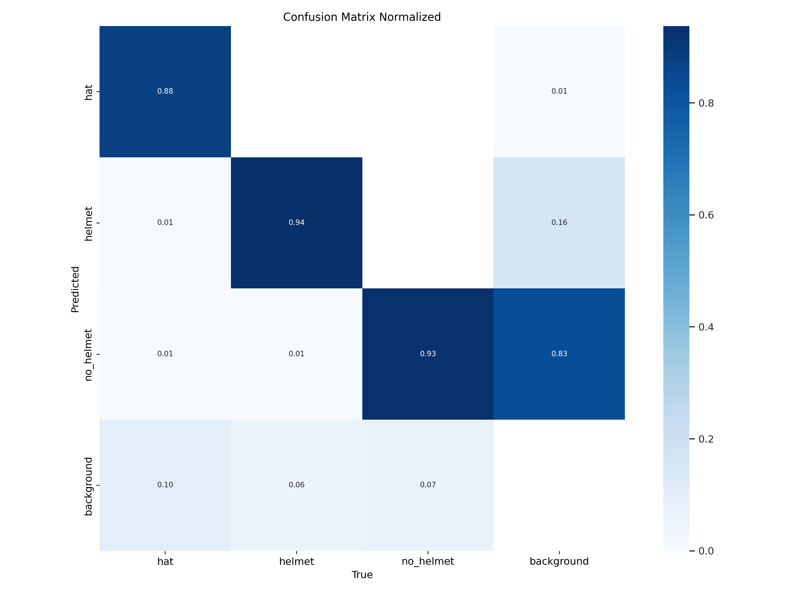
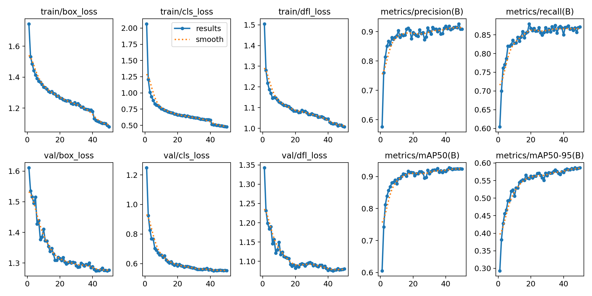

# Model for detecting Hardhats and Hats


<div align="center">
  
</div>

## Model binary

You can [download the model from here](https://github.com/luisarizmendi/ai-apps/raw/refs/heads/main/models/luisarizmendi/object-detection-hardhat-or-hat/object-detection-hardhat-or-hat-m.pt)


## Base Model

Ultralytics/YOLO11m


## Huggingface page

https://huggingface.co/luisarizmendi/hardhat-or-hat


## Model Dataset

[https://universe.roboflow.com/luisarizmendi/hardhat-or-hat](https://universe.roboflow.com/luisarizmendi/hardhat-or-hat)

## Labels

```
- hat
- helmet
- no_helmet
```


## Model metrics

```
YOLO11m summary (fused): 303 layers, 20,032,345 parameters, 0 gradients, 67.7 GFLOPs
                 Class     Images  Instances      Box(P          R      mAP50  mAP50-95)
                   all       1992      15306      0.844      0.847      0.893      0.546
                   hat        244        287      0.869      0.811      0.876      0.578
                helmet       1202       3942      0.916      0.892      0.942       0.61
             no_helmet        741      11077      0.746      0.838      0.861       0.45
```


<div align="center">
   
</div>


## Model training

You can [review the Jupyter notebook here](https://github.com/luisarizmendi/ai-apps/blob/main/dev/hardhat-or-hat/train.ipynb)

### Hyperparameters

```
base model: yolov11x.pt
epochs: 150
batch: 16
imgsz: 640
patience: 5
optimizer: 'SGD'
lr0: 0.001
lrf: 0.01
momentum: 0.9
weight_decay: 0.0005
warmup_epochs: 3
warmup_bias_lr: 0.01
warmup_momentum: 0.8
```

### Augmentation

```
hsv_h=0.015,  # Image HSV-Hue augmentationc
hsv_s=0.7,   # Image HSV-Saturation augmentation
hsv_v=0.4,   # Image HSV-Value augmentation
degrees=10,  # Image rotation (+/- deg)
translate=0.1,  # Image translation (+/- fraction)
scale=0.3,   # Image scale (+/- gain)
shear=0.0,   # Image shear (+/- deg)
perspective=0.0,  # Image perspective
flipud=0.1,  # Image flip up-down
fliplr=0.1,  # Image flip left-right
mosaic=1.0,  # Image mosaic
mixup=0.0,   # Image mixup
```


## Model Usage

### Usage with Huggingface spaces

If you don't want to run it locally, you can use [this huggingface space](https://huggingface.co/spaces/luisarizmendi/object-detection-batch) that I've created with this code but be aware that this will be slow since I'm using a free instance, so it's better to run it locally with the python script below.

Remember to check that the Model URL is pointing to the model that you want to test.

<div align="center">
  
</div>


### Usage with Python script

Install the following PIP requirements

```
gradio
ultralytics
Pillow
opencv-python
torch
```

Then [run the python code below ](https://github.com/luisarizmendi/ai-apps/raw/refs/heads/main/models/luisarizmendi/object-detector-hardhat-or-hat/run_model.py) and open `http://localhost:7860` in a browser to upload and scan the images.


```
import gradio as gr
from ultralytics import YOLO
from PIL import Image
import os
import cv2
import torch

DEFAULT_MODEL_URL = "https://github.com/luisarizmendi/ai-apps/raw/refs/heads/main/models/luisarizmendi/object-detection-hardhat-or-hat/object-detection-hardhat-or-hat-m.pt"

def detect_objects_in_files(model_input, files):
    """
    Processes uploaded images for object detection.
    """
    if not files:
        return "No files uploaded.", []

    model = YOLO(str(model_input))
    if torch.cuda.is_available():
        model.to('cuda')
        print("Using GPU for inference")
    else:
        print("Using CPU for inference")

    results_images = []
    for file in files:
        try:
            image = Image.open(file).convert("RGB")
            results = model(image)
            result_img_bgr = results[0].plot()
            result_img_rgb = cv2.cvtColor(result_img_bgr, cv2.COLOR_BGR2RGB)
            results_images.append(result_img_rgb)

            # If you want that images appear one by one (slower)
            #yield "Processing image...", results_images

        except Exception as e:
            return f"Error processing file: {file}. Exception: {str(e)}", []

    del model
    torch.cuda.empty_cache()

    return "Processing completed.", results_images

interface = gr.Interface(
    fn=detect_objects_in_files,
    inputs=[
        gr.Textbox(value=DEFAULT_MODEL_URL, label="Model URL", placeholder="Enter the model URL"),
        gr.Files(file_types=["image"], label="Select Images"),
    ],
    outputs=[
        gr.Textbox(label="Status"),
        gr.Gallery(label="Results")
    ],
    title="Object Detection on Images",
    description="Upload images to perform object detection. The model will process each image and display the results."
)

if __name__ == "__main__":
    interface.launch()

```


